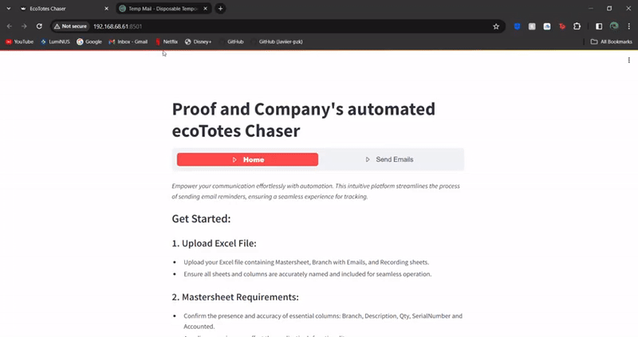

# Proof & Company Email Automation

## Table of Contents

- [Proof & Company Email Automation](#proof--company-email-automation)
  - [Overview](#overview)
  - [Challenges](#challenges)
  - [Solution](#solution)
    - [Email Automation Script](#email-automation-script)
    - [Streamlit Web Application](#streamlit-web-application)
  - [Technologies Used](#technologies-used)
  - [Demonstration](#demonstration)
  - [Business Impact](#business-impact)

## Overview

This project streamlines the container collection process for Proof & Company, a local alcoholic beverage supplier, by introducing automation and enhancing efficiency. The company's operations involve supplying beverages to bars and restaurants in eco-friendly crates, which are later collected for recycling. Before sending invoices, Proof & Company sends out two email reminders weekly. These emails are manually sent and required manual input of data from an auto-generated excel sheet, a time-consuming and error-prone process.

## Challenges

- **Manual Data Entry:** Data for the email content, including tables and attachments, was previously inputted manually, leading to inefficiencies and potential errors.
- **Manual Email Sending and Tracking:** Emails are sent to each branch manually after the data is curated and replies from branches are tracked over time; a tedious and cumbersome process.
- **Repetitive Quarterly Process:** As the company repeats this process quarterly, the manual effort invested in each cycle became a significant overhead.

## Solution

The project addresses these challenges through a two-fold solution:

1. **Email Automation Script:**
   - **Data Processing:** Utilizes pandas to seamlessly read data from an Excel file into a dataframe.
   - **Dynamic Table Generation:** Dynamically generates data for the email table, eliminating the need for manual input.
   - **Automated Email Sending:** Leveraged Python email library's MIME capabilities and SMTP library to automate the process of sending reminder emails programmatically.
   - **Enhanced Email Content:** Each email is enriched with a standard template, inline image, and attachment, providing comprehensive information to recipients.
   - **Optimised delivery:** Send email function calls are set to timeout in 5 seconds, enhancing reliability, and gracefully handles delays or errors. Additionally, a delay of 3 seconds between each email sending is implemented to ensure compliance with Microsoft outlook's rate limit.
    
2. **Streamlit Web Application:**
   - **User-Friendly Interface:** Provides a simple and intuitive interface using Streamlit, catering to users with varying levels of technical expertise.
   - **Excel File Upload:** Allows users to upload Excel files, streamlining the data input process.
   - **Preview Section:** Offers a select box for users to easily switch bewtween email templates for different stages of ecoTote collection process. Offers a preview of the email content before sending, ensuring accuracy.
   - **Automated Tracking:** Utilised Pandas and XlsxWriter to update and write data to Excel sheets, ensuring seamless integration with the existing Excel-based workflow of Proof & Company. The Excel file is made available for download for tracking purposes.

## Technologies Used

The project leverages the following technologies:

- Python: Core programming language for scripting and automation.
- HTML & CSS: Crafting and specific styling of email text content.
- Streamlit: Framework for building interactive web applications.
- Pandas: Data manipulation and analysis library for handling Excel data.
- SMTP: Simple Mail Transfer Protocol for sending emails programmatically.
- XlsxWriter: Library for writing data and formatting information to Excel files.
- Func_timeout: Library for adding timeouts to function calls, enhancing reliability.

## Demonstration

To maintain the security and privacy of Proof & Company's resources, access to view the application is not provided. However, for demonstration purposes, visual representations of the application will be provided in the form of GIFs and images.

## Business Impact

- **Resource Savings:** With the streamlined automation, Proof & Company estimates saving the equivalent of two teams' worth of man-hours per quarter.
- **Efficiency Gains:** The automation of the email reminder process has reduced the time and manual effort required by up to 90%, resulting in improved overall efficiency.
- **Error Reduction:** Eliminating manual data entry minimizes the risk of errors in email content, contributing to a more reliable communication process.
- **Scalability:** The automated script and web application are designed to handle the repetitive quarterly process with ease, providing scalability for future business needs.

